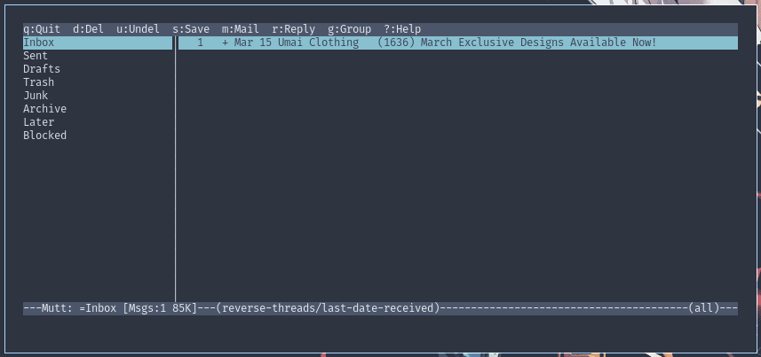

# mutt-nord
This is an unofficial port created by [CramMK](https://github.com/CramMK) based on the colors from the [Nord](https://nordtheme.com) theme.

## Screenshot

## Requirements
Your terminal needs to have a nord color scheme, as mutt makes use of these colors.

## Improvements
If you have ideas for improvements, please open a PR!
